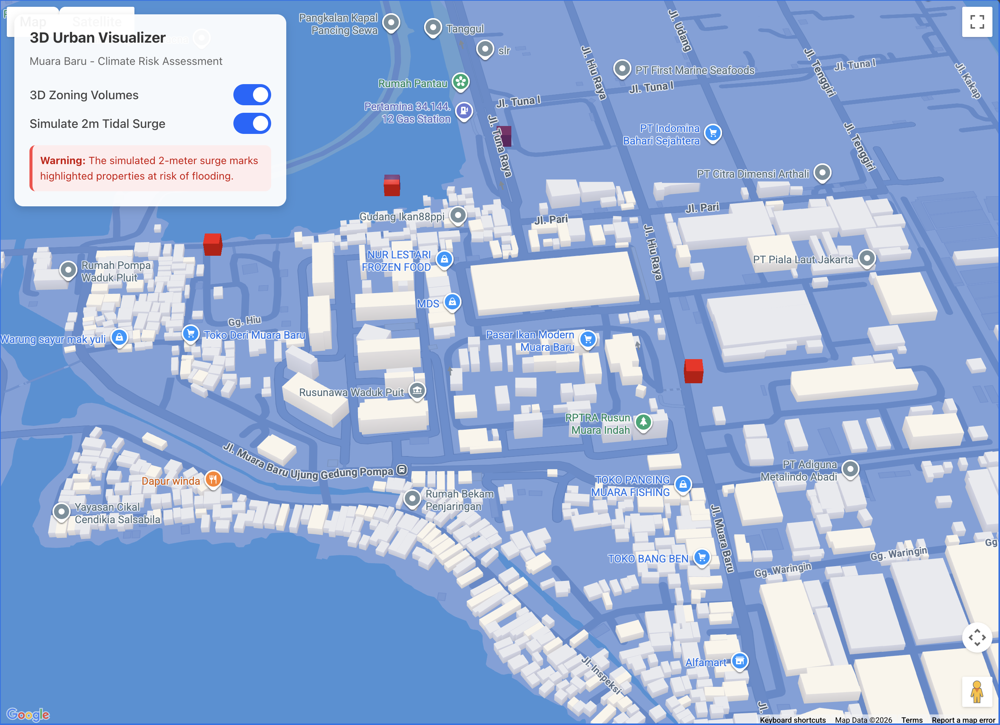

# 3D Urban Development Visualizer

A web-based 3D visualization tool built with React, Vite, and Google Maps Platform. It leverages **Photorealistic 3D Tiles** and **WebGL Overlay View** with [Three.js](https://threejs.org/) to simulate urban scenarios. 

### Tech Stack
Google Maps API, Google BigQuery, Gemini, Three.js, Vite, React
Currently, the project focuses on visualizing a **2-meter Tidal Surge simulation** in the Muara Baru region of Jakarta, highlighting mock building assets that are at risk based on their elevation.



## Architecture
- **Framework:** React + Vite
- **Mapping:** [@vis.gl/react-google-maps](https://visgl.github.io/react-google-maps/)
- **3D Engine:** [Three.js](https://threejs.org/) + [@googlemaps/three](https://github.com/googlemaps/js-three)
- **Styling:** Custom CSS + HTML

## Features
*   **Google Maps 3D Integration**: Utilizes Map IDs configured for 3D Photorealistic Tiles and Vector maps.
*   **WebGL Overlay**: Integrates `ThreeJSOverlayView` to precisely sync 3D meshes (the tidal surge and building extrusions) with the map's geography and camera movements.
*   **Data Visualization**: Places 3D indicators over simulated building footprints depending on specific criteria (e.g., base elevation vs. tidal surge height).
*   **Interactive UI**: A simple toggle allows users to view the 'before' and 'after' effects of the 2m tidal surge directly over the 3D map.

## Prerequisites

To run this project, you will need:
1.  **Node.js** (v18+)
2.  **Google Maps API Key**: Ensure you have a Google Cloud Platform account with the **Maps JavaScript API** and **Map Tiles API** enabled.
3.  **Google Maps Map ID**: You need a specific [Map ID](https://console.cloud.google.com/google/maps-apis/studio/maps) tied to your API Key.
    *   **CRITICAL**: When creating the Map ID, its type **must** be set to **JavaScript -> Vector**.
    *   You must also edit the Map ID settings and enable **Tilt and Rotation** under the Map style section.

## Installation & Setup

1. **Clone or Download** the repository to your local machine.

2. **Navigate** into the project directory:
   ```bash
   cd 3d-urban-dev-vis
   ```

3. **Install Dependencies**:
   ```bash
   npm install
   ```

4. **Environment Variables Configuration**:
   Create a `.env` file in the root of the project (next to `vite.config.js`) and add your Google Maps credentials:
   ```env
   VITE_GOOGLE_MAPS_API_KEY=your_api_key_here
   VITE_GOOGLE_MAP_ID=your_map_id_here
   ```

## Running the Application

Start the Vite development server:
```bash
npm run dev
```
Open your browser and navigate to the URL provided in the terminal (usually `http://localhost:5173/`).

## Project Structure
- `src/App.jsx`: Main entry point containing the floating UI and the map wrapper.
- `src/components/MapComponent.jsx`: Handles map initialization and configuration.
- `src/components/TidalSurgeOverlay.jsx`: Contains the core Three.js logic to render the water plane and building highlight meshes synchronized to map coordinates.
- `src/data/mockBuildingAssets.js`: A mock array simulating data that would typically be fetched from a database like BigQuery.
